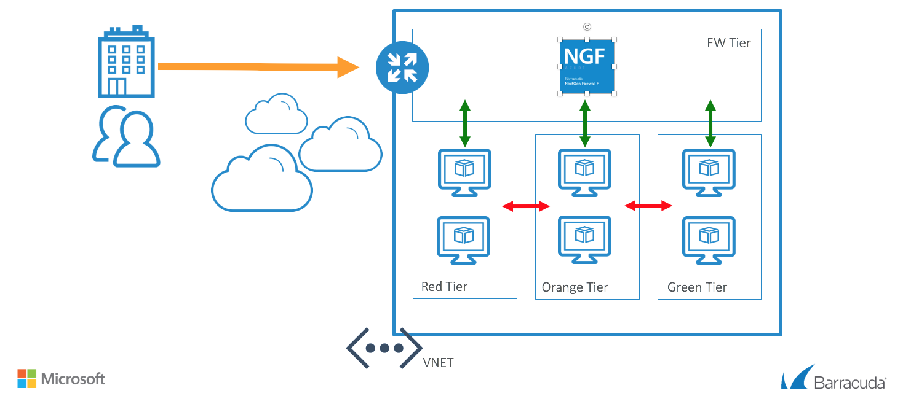

# Barracuda Next Gen Firewall F Series Quick Start Single Availability

## Introduction
This Azure Resource Manager (ARM) template will deploy the Barracuda Next Gen Firewall F Series in a new VNET. Deployment is done with in a one-armed fashion where north-south, east-west and VPN tunnel traffic can be intercepted and inspected based on the User Defined Routing that is attached to the subnets that need this control. Do not apply any UDR to the subnet where the NGF is located that points back to the NGF. This will cause routing loops.

To adapt this deployment to your requirements you can modify the azuredeploy.paramters.json file and/or the deployment script in Powershell or Azure CLI (Bash).

## Prerequisites
The solution does a check of the template when you use the provide scripts. It does require that [Programmatic Deployment](https://azure.microsoft.com/en-us/blog/working-with-marketplace-images-on-azure-resource-manager/) is enabled for the Barracuda Next Gen Firewall F BYOL or PAYG images. Barracuda recommends use of **D**, **D_v2**, **F** or newer series. 

## Deployed resources
Following resources will be created by the template:
- One Azure VNET with 1 subnet (for the NGF, additional subnets can be configured afterwards or added in the ARM template)
- One route table that will route all traffic for networks except for the internal networks to the NGF
- One Virtual machine with a network interface and public IP

**Note** The backend subnets and resources are *not* automatically created by the template. This has to be done manually after template deployment has finished.

## Template Parameters
| Parameter Name | Description
|---|---
adminPassword | Password for the Next Gen Admin tool 
prefix | identifying prefix for all VM's being build. e.g WeProd would become WeProd-VM-NGF (Max 19 char, no spaces, [A-Za-z0-9]
vNetPrefix | Network range of the VNET (e.g. 172.16.136.0/22)
subnetPrefixNGF | Network range of the Subnet containing the NextGen Firewall (e.g. 172.16.136.0/24)
imageSKU | SKU Hourly (PAYG) or BYOL (Bring your own license)
vmSize | Size of the VMs to be created
ccManaged | Is this instance managed via a Next Gen Control Center (Yes/No)
ccClusterName | The name of the cluster of this instance in the Next Gen Control Center
ccRangeId | The range location of this instance in the Next Gen Control Center
ccIpAddress | IP address of the Next Gen Control Center
ccSecret | Secret to retrieve the configuration from the Next Gen Control Center

## Launching the Template
The package provides a deploy.ps1 and deploy.sh for Powershell or Azure CLI based deployments. This can be peformed from the Azure Portal as well as the any system that has either of these scripting infrastructures installed. Or you can deploy from the Azure Portal using the provided link.

## Additional Resources