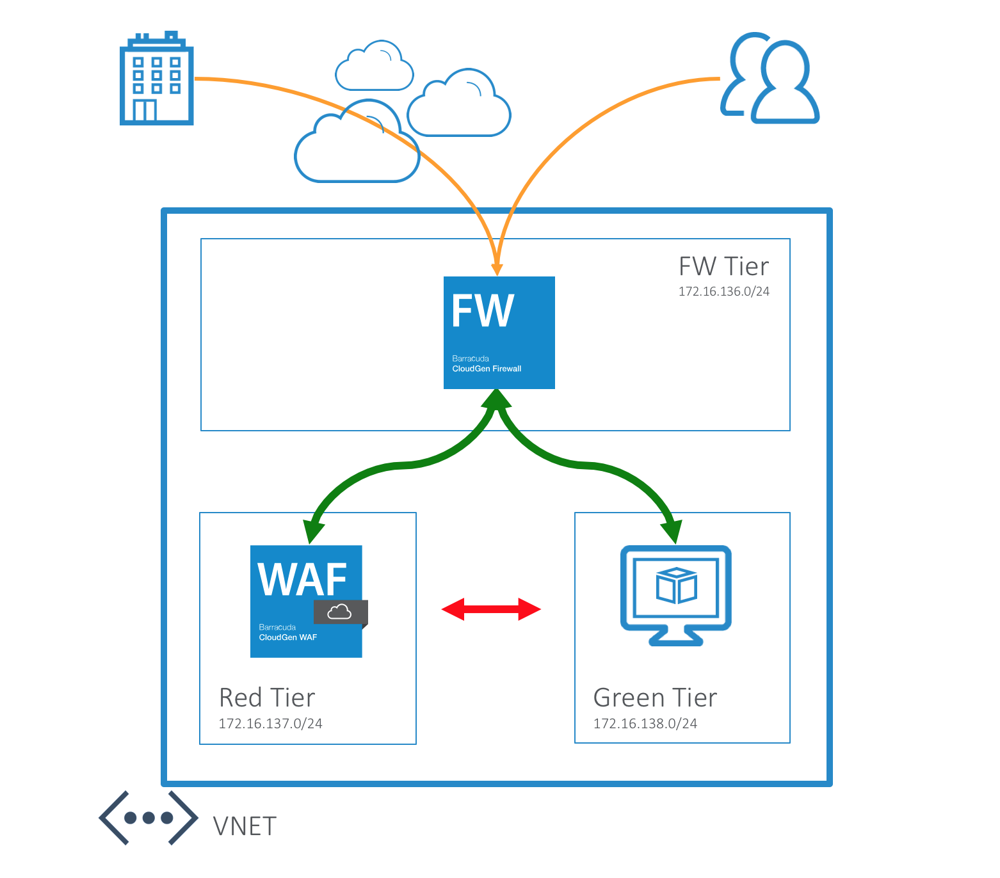

# Workshop - Cloud Generation Firewall deployment in Microsoft Azure

## Introduction
This Azure Resource Manager (ARM) template will deploy a single available environment to protect a vulnerable web application hosted on Microsoft Azure. Deployment is done in a one-armed fashion where north-south, east-west and VPN tunnel traffic can be intercepted and inspected based on the User Defined Routing that is attached to the subnets that need this control. After deployment we will adapt the UDR routing, firewall and waf configuration as required. Do not apply any UDR to the subnet where the NGF is located that points back to the NGF. This will cause routing loops.

To adapt this deployment to your requirements you can modify the azuredeploy.paramters.json file and/or the deployment script in Powershell or Azure CLI (Bash).

## Prerequisites
The solution does a check of the template when you use the provided scripts. It does require that [Programmatic Deployment](https://azure.microsoft.com/en-us/blog/working-with-marketplace-images-on-azure-resource-manager/) is enabled for the Barracuda CloudGen Firewall and Barracuda CloudGen WAF BYOL or PAYG images. Barracuda recommends use of **D**, **D_v2**, **F** or newer series. 

## Deployment

The package provides a deploy.ps1 and deploy.sh for Powershell or Azure CLI based deployments. This can be peformed from the Azure Portal as well as the any system that has either of these scripting infrastructures installed. Or you can deploy from the Azure Portal using the provided link.

## Deployed resources
Following resources will be created by the template:
- One Azure VNET with 3 subnets (1 for the CGF, 1 Red Zone for the WAF and 1 Green zone for the Badstore vulnerable web app)
- Two route tables that will contain required routing but are not yet applied to the red and green subnet
- One Barracuda CloudGen Firewall virtual machines with 1 network interface and public IP
- One Barracuda CloudGen Web Application Firewall virtual machines with 1 network interface and public IP
- One Ubuntu Linux Server with Docker and the Badstore container configured during deployment

## Next Steps

After successful deployment you can manage the Barracuda products via a web console or the CloudGen Firewall also has a CloudGen Admin windows console application.Management IP addresses you'll find in instances properties, username for the CGF is *root* and the password is what you provided during template deployment. For the WAF the username is admin adn the password you provided during deployment. The linux backend systems is also reachable via SSH using the user azureuser and the password you provided during deployment.

## Post Deployment Configuration

The Barracuda CloudGen Firewall [implementation guide](https://campus.barracuda.com/product/cloudgenfirewall/doc/73718958/implementation-guide-cloudgen-firewall-in-azure/) will assist you in deployment of the system or you can follow the workshop trainer for a step by step guide.

The Barracuda CloudGen Web Applcation Guide [implementation guide](https://campus.barracuda.com/product/webapplicationfirewall/doc/49056908/deploying-and-provisioning-the-barracuda-cloudgen-waf-for-azure) will assist you in deployment of the system or you can follow the workshop trainer for a step by step guide.

It is also recommended you harden management access by enabling multifactor or key authentication and by restricting access to management interface using Management ACL: [How to Change the Root Password and Management ACL](https://campus.barracuda.com/product/nextgenfirewallf/article/NGF71/ChangeRootPWandMgmtACL/)

## Template Parameters
| Parameter Name | Description
|---|---
adminPassword | Password for the Next Gen Admin tool 
prefix | identifying prefix for all VM's being build. e.g WeProd would become WeProd-VM-NGF (Max 19 char, no spaces, [A-Za-z0-9]
vNetAddressSpace | Network range of the VNET (e.g. 172.16.136.0/22)
subnetNGF | Network range of the subnet containing the NextGen Firewall (e.g. 172.16.136.0/24)
subnetRed | Network range of the red subnet (e.g. 172.16.137.0/24)
subnetGreen | Network range of the green subnet (e.g. 172.16.138.0/24)
imageSKU | SKU Hourly (PAYG) or BYOL (Bring your own license)
vmSize | Size of the VMs to be created
